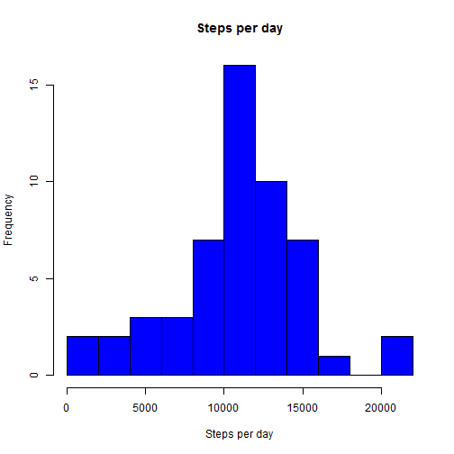
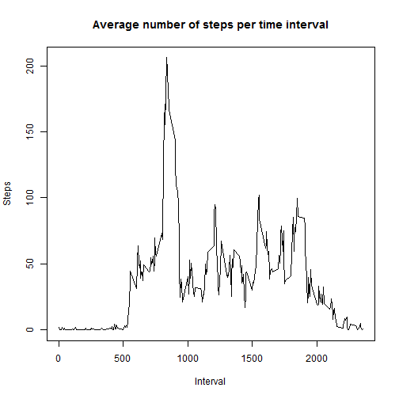
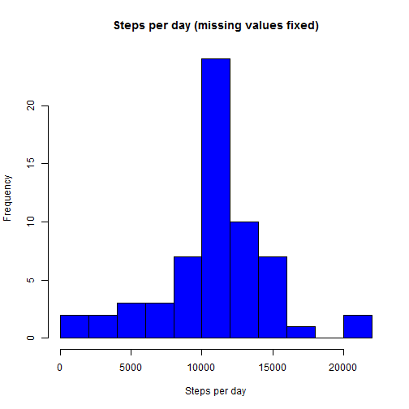
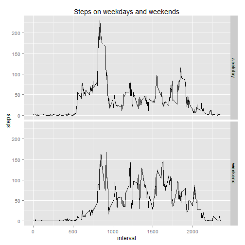

## Loading and preprocessing the data

```r
data <- read.csv('data/activity.csv')
```


## What is mean total number of steps taken per day?

```r
daily <- aggregate(data$steps, by=list(data$date), FUN=sum)
meanSteps <- mean(daily$x, na.rm=TRUE)
medianSteps <- median(daily$x, na.rm=TRUE)
hist(daily$x, breaks=10, col="blue", xlab="Steps per day", main="Steps per day")
```

 


On average, a person did 10766.19 steps per day, with median value being 10765.


## What is the average daily activity pattern?


```r
avgInt <- aggregate(steps ~ interval, data, mean )
maxAvg <- avgInt[avgInt$steps==max(avgInt$steps),]
plot(avgInt$interval, avgInt$steps,type="l",
     main="Average number of steps per time interval", 
     xlab="Interval", ylab="Steps")
```

 

On average, the most steps (206.17) were done in the interval number 835

## Imputing missing values

The dataset has 2304 rows with missing values for number of steps. To fix it, the missing values will be replaced with the average values for the corresponding time interval.


```r
dataFixed <- merge(data, avgInt, by=c("interval"))
names(dataFixed) = c('interval', 'steps', 'date', 'avgSteps')
dataFixed$avgSteps <- round(dataFixed$avgSteps)
dataFixed$steps[is.na(dataFixed$steps)] <- dataFixed$avgSteps[is.na(dataFixed$steps)]
dataFixed$avgSteps <- NULL
daily <- aggregate(dataFixed$steps, by=list(dataFixed$date), FUN=sum)
meanSteps <- mean(daily$x)
medianSteps <- median(daily$x)
hist(daily$x, breaks=10, col="blue",
     xlab="Steps per day", 
     main="Steps per day (missing values fixed)")
```

 

On average, a person did 10765.64 steps per day, with median value being 10762.00. As we can see, imputing missing values only slightly affected those values.

## Are there differences in activity patterns between weekdays and weekends?

```r
library(ggplot2)
dataFixed$date <- as.Date(dataFixed$date)
dataFixed$weekday <- weekdays(dataFixed$date)
dataFixed$weekend <- "weekday"
dataFixed[dataFixed$weekday %in% c("Saturday","Sunday"),"weekend"] <- "weekend"
dataFixed$weekend <- factor(dataFixed$weekend)
avgDays <-aggregate(dataFixed$steps, 
                    list(interval=dataFixed$interval, 
                         weekend = dataFixed$weekend), mean)
g <- ggplot(avgDays, aes(interval, x))
g <- g + geom_line(stat="identity")
g <- g+labs( x="interval", y="steps")
g <- g+ ggtitle("Steps on weekdays and weekends")
g <- g  + facet_grid(weekend ~.)
print(g) 
```

 
